# Cryptocurrency-time-series-forecasting
Прогнозирование цен криптовалют с использованием Deep Learning. Сравнение производительности LSTM, GRU и BiLSTM на волатильных и структурированных данных.

## Навигация по репозиторию

В данном репозитории находятся следующие материалы:

1.  ***cripta.ipynb*** — Основной Jupyter Notebook. Содержит полный цикл разработки: загрузка данных, предобработка (Scaling, Sliding Window), обучение нейросетей и код для генерации графиков.
2.  ***images/*** — Папка с сохраненными графиками и визуализациями прогнозов, полученными в ходе работы.
3.  ***README.md*** — Файл с описанием проекта.
    > *Здесь собраны **все ключевые метрики и финальные выводы** исследования, чтобы вы могли оценить результаты без необходимости просматривать громздкий файл "cripta.ipynb".*
##  EDA

На начальном этапе работы была произведена инициализация рабочей среды и чтение исходного датасета. Мы провели последовательный анализ каждого актива для понимания структуры временных рядов.

### 1. Bitcoin (BTC)
Первым был загружен и обработан массив данных главной криптовалюты. 

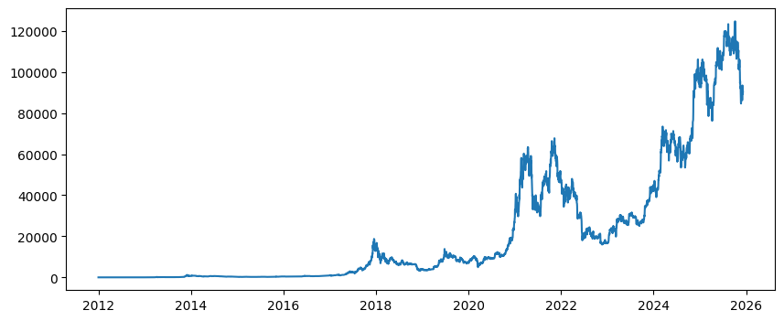

### 2. Solana (SOL)
Далее были считаны данные для Solana.

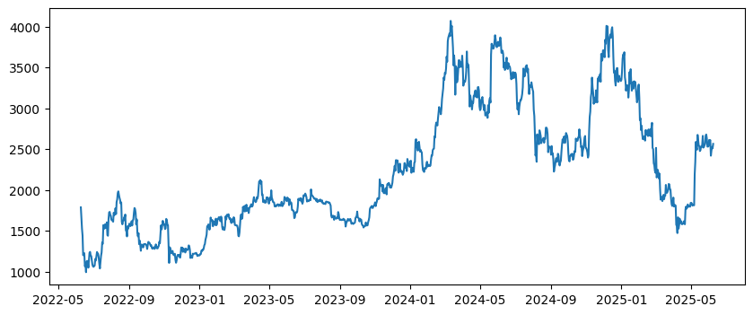

### 3. Ethereum (ETH)
В завершение этапа EDA были загружены и визуализированы исторические данные Ethereum.

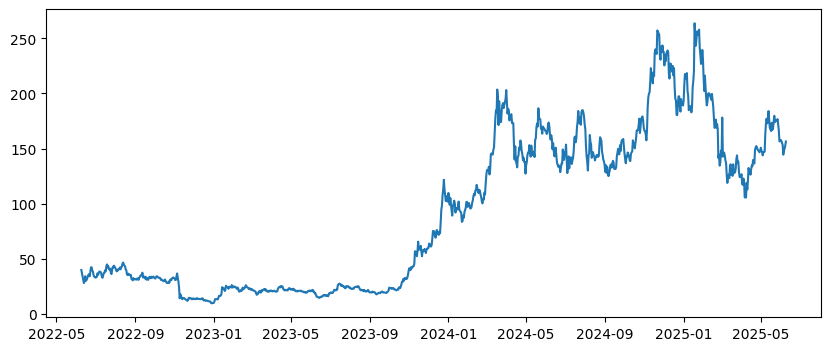

## Feature Engineering

После визуального анализа мы перешли к этапу глубокой подготовки данных. Чтобы улучшить прогностическую способность моделей, были выполнены следующие преобразования:

1.  **Объединение датафреймов:**
    Исходные данные по BTC, ETH и SOL были синхронизированы по временной шкале и объединены. 

2.  **Генерация новых признаков:**
    На основе базовых цен (OHLCV) были созданы дополнительные метрики. 

3.  **Создание лагов (Lag Features):**
    Для обучения моделей временных рядов (Time Series) критически важно учитывать исторический контекст. Были сгенерированы **лаговые признаки**  Это позволяет подавать на вход модели не только текущую цену, но и её значения `n` шагов назад, формируя "окно" истории, на основе которого строится прогноз.

##  Evaluation Metrics

Для объективного сравнения моделей была реализована **кастомная функция оценки**, которая рассчитывает комплексный набор метрик. 

### 1. Classic regression metrics

### MAE (Mean Absolute Error)
$$MAE = \frac{1}{n} \sum_{i=1}^{n} |y_i - \hat{y}_i|$$


### RMSE (Root Mean Squared Error)
$$RMSE = \sqrt{\frac{1}{n} \sum_{i=1}^{n} (y_i - \hat{y}_i)^2}$$


### MAPE (Mean Absolute Percentage Error)
$$MAPE = \frac{100}{n} \sum_{i=1}^{n} \left| \frac{y_i - \hat{y}_i}{y_i} \right|$$

Средняя процентная ошибка. Позволяет сравнивать рряды разных масштабов.

### WMAPE (Weighted Mean Absolute Percentage Error)
$$WMAPE = \frac{100 \sum_{i=1}^{n} |y_i - \hat{y}_i|}{\sum_{i=1}^{n} |y_i|}$$

Взвешенная MAPE. Более стабильна, чем MAPE.

### Bias (CFE)
$$Bias = \sum_{i=1}^{n} (y_i - \hat{y}_i)$$

Кумулятивная ошибка. Показывает систематическое смещение:
- Bias ≈ 0: нет смещения 
- Bias > 0: модель недооценивает
- Bias < 0: модель переоценивает

### 2. Shape & Time Warping

### Z-score нормализация
$$z_i = \frac{x_i - \mu}{\sigma + \varepsilon}$$

Приводит ряды к стандартному виду (среднее = 0, стд. отклонение = 1).


### DTW Distance (Dynamic Time Warping)
Динамическое выравнивание временных рядов с учетом временных сдвигов:

$$D[i,j] = |a_i - b_j| + \min(D[i-1,j], D[i,j-1], D[i-1,j-1])$$

Нормализованное: $d_1 = \frac{DTW(a,b)}{n}$
**Диапазон:** 0 до ∞

**Интерпретация:**
- **DTW ≈ 0** = Ряды идеально совпадают (форма и уровни)
- **DTW = 0.1-0.3** = Очень хорошее совпадение 
- **DTW = 0.3-0.5** = Хорошее совпадение 
- **DTW > 0.5** = Слабое совпадение 

### DTW производных
$$d_2 = \frac{DTW(\nabla y, \nabla \hat{y})}{n-1}$$

**Диапазон:** 0 до ∞

**Интерпретация:**
- **DTW_deriv ≈ 0** = Одинаковая **динамика изменений** (тренды совпадают)
- **DTW_deriv = 0.1-0.2** = Очень хорошее совпадение тренда 
- **DTW_deriv = 0.2-0.4** = Хорошее совпадение тренда
- **DTW_deriv > 0.4** = Разные тренды 


Оценивает совпадение скоростей изменения (трендов).


### Shape Score (геометрическое сходство)
$$ShapeScore = \frac{1}{1 + d}, \quad d = 0.5 \cdot d_1 + 0.5 \cdot d_2$$

**Диапазон:** 0 до 1
- 1.0 = идеальное совпадение формы
- 0.5 = среднее совпадение
- ≈0 = формы совершенно разные

Не зависит от масштаба и амплитуды ряда.


## Pipeline description


Для обеспечения чистоты эксперимента и возможности сравнения результатов, ко всем трем активам (BTC, ETH, SOL) применялся единый стандартизированный цикл обработки данных и обучения.

Процесс анализа для каждой валюты состоит из 6 последовательных этапов:

### 1. Предобработка данных (Preprocessing)
* **Логарифмирование целевой переменной ($y$):** Для стабилизации дисперсии и приведения ряда к более стационарному виду использовалось преобразование $np.log(y)$. Это особенно важно для криптовалют с их экспоненциальным ростом.
* **Нормализация (Scaling):** Признаки были приведены к единому масштабу с помощью `StandardScaler` ($\mu=0, \sigma=1$), чтобы ускорить сходимость градиентного спуска.

### 2. Формирование тензоров (Sliding Windows)
Временной ряд преобразовывался в структуру для обучения с учителем (Supervised Learning) методом **скользящего окна**:
* На вход подается последовательность длиной `N` дней (Lookback period).
* На выходе прогнозируется значение на `N+1` день.

### 3-5. Обучение моделей (Model Training)
Для каждого актива последовательно обучались и тестировались три архитектуры:

####  3. BiLSTM (Bidirectional LSTM)
* **Архитектура:** Двунаправленная LSTM, которая смотрит на последовательность как от прошлого к будущему, так и обратно.
* **Цель:** Попытка уловить контекст не только из предшествующих значений, но и общей структуры окна.
* **Вывод:** Графики обучения (Loss) и предсказания на тестовой выборке (1 месяц vs Вся история).

####  4. GRU (Gated Recurrent Unit)
* **Архитектура:** Упрощенная версия рекуррентной сети без выходного гейта.
* **Цель:** Проверка гипотезы, что более простая модель лучше справится с шумом и быстрее обучится без переобучения.

####  5. LSTM (Long Short-Term Memory)
* **Архитектура:** Классическая полносвязная LSTM сеть.
* **Цель:** Базовый бенчмарк для работы с долгосрочными зависимостями во временных рядах.

### 6. Сравнительный анализ (Comparison)
Финальный этап включает:
* Сводный график предсказаний всех трех моделей на одном полотне.
* Таблицу с метриками (RMSE, MAPE, ShapeScore) для выявления лидера.


## BTC

### 3. Эксперимент 1: BiLSTM (Bidirectional LSTM)

Первой мы исследовали двунаправленную рекуррентную сеть (BiLSTM). В отличие от стандартных моделей, эта архитектура обрабатывает входную последовательность одновременно в двух направлениях: от прошлого к настоящему и обратно. Это позволяет модели улавливать контекст, который может быть упущен при однонаправленном анализе.

#### 3.1 Архитектура сети
Конфигурация модели была спроектирована для борьбы с переобучением и выделения сложных паттернов:
* **Входной слой:** Принимает временные окна фиксированного размера.
* **Скрытые слои:** Два последовательных слоя **Bidirectional LSTM** (по 50 нейронов в каждом), которые извлекают признаки из временного ряда.
* **Регуляризация:** После каждого рекуррентного слоя применяется **Dropout (20%)**, что отключает часть нейронов и предотвращает запоминание шума.
* **Выход:** Полносвязный слой (Dense) с одним нейроном для прогнозирования конечной цены.

#### 3.2 Динамика обучения
Обучение проводилось с использованием оптимизатора **Adam** и функции потерь **MSE**. Для предотвращения переобучения использовался механизм ранней остановки (Early Stopping), который прерывал процесс, если ошибка на валидации переставала снижаться.

Ниже представлен график функции потерь, показывающий сходимость модели:

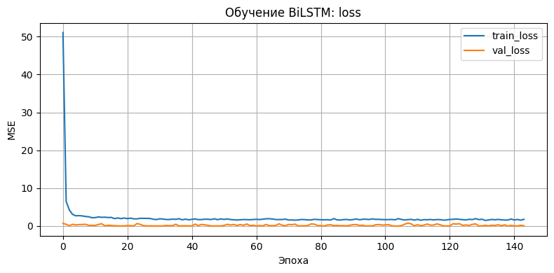

Ниже представлен график функции валидации, показывающий среднюю ошибку модели:

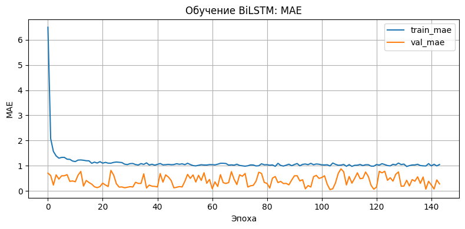


#### 3.3 Метрики качества
По итогам тестирования на отложенной выборке модель показала следующие результаты:

| Тип метрики | Метрика | Значение | Интерпретация |
|:---:|:---|:---|:---|
| **Ошибки регрессии** | **MAE** | 4,836.01 | Среднее абсолютное отклонение цены ($). |
| | **WMAPE** | 5.08% | Взвешенная процентная ошибка. |
| | **Bias (CFE)** | -473,566.05 | *Отрицательное смещение:* модель склонна слегка **переоценивать** цену (Forecast > Actual). |
| **Геометрия ряда** | **DTW (Norm)** | 0.272 | Хорошее совпадение уровней цен (диапазон 0.1-0.3). |
| | **DTW Deriv** | 0.236 | Хорошее совпадение динамики изменений. |
| | **ShapeScore** | **0.7975** | **Высокое качество:** форма прогноза совпадает с реальностью на ~80%. |
#### 3.4 Визуализация прогнозов
Графический анализ подтверждает выводы метрик.

**Детальный прогноз (Тестовый период):**
На графике ниже видно сравнение реальной цены  и прогноза модели  на тестовом месяце.
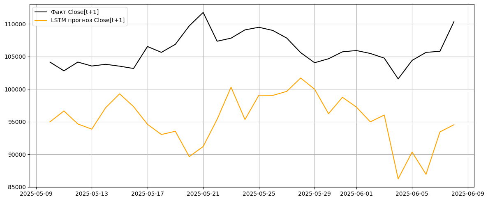

**Прогноз на всей истории:**
Общая картина поведения модели на всем доступном временном промежутке.
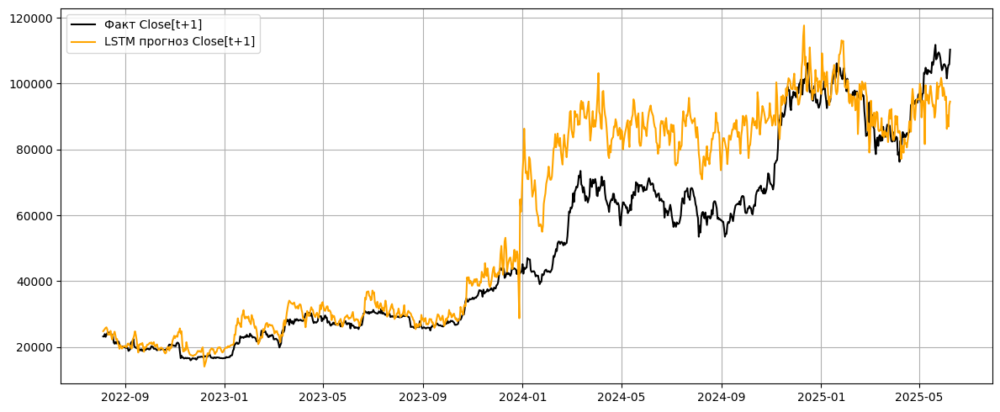


### 4. Эксперимент 2: GRU (Gated Recurrent Unit)

Вторым этапом мы протестировали сеть GRU. Это упрощенная вариация LSTM, которая не имеет выходного гейта (output gate). Гипотеза заключалась в том, что более "легкая" модель может быстрее обучаться и быть менее склонной к переобучению на шумных данных, однако ей может не хватить сложности для описания волатильности Биткоина.

#### 4.1 Архитектура сети
Архитектура зеркальна предыдущему эксперименту для честности сравнения, но использует другие рекуррентные ячейки:
* **Входной слой:** Скользящее окно данных.
* **Скрытые слои:** Два последовательных слоя **GRU** (по 50 нейронов), которые сохраняют память о предыдущих состояниях.
* **Регуляризация:** Аналогичный **Dropout (20%)** после каждого слоя.
* **Выход:** Полносвязный слой (Dense) для финальной регрессии.

#### 4.2 Динамика обучения
Использовались те же гиперпараметры: оптимизатор **Adam**, функция потерь **MSE** и механизм **Early Stopping**.

График потерь показывает, что модель сходится, но финальная ошибка остается выше, чем у BiLSTM:

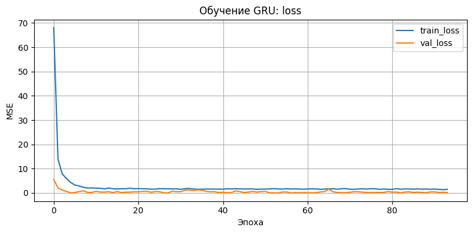

График валидации (MAE) демонстрирует колебания ошибки в процессе обучения:

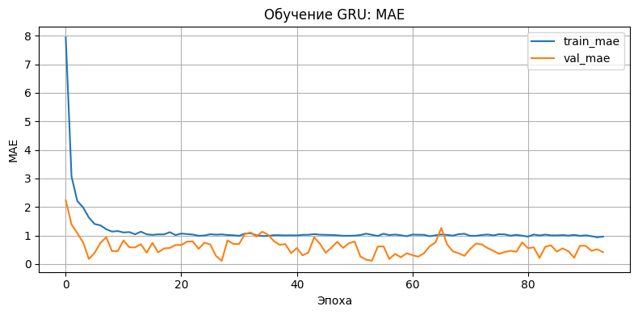


#### 4.3 Метрики качества
Результаты тестирования показали, что упрощение архитектуры негативно сказалось на точности прогноза для столь сложного актива, как Bitcoin.

| Тип метрики | Метрика | Значение | Интерпретация |
|:---:|:---|:---|:---|
| **Ошибки регрессии** | **MAE** | 8,672.04 | Почти в 2 раза выше, чем у BiLSTM. |
| | **WMAPE** | 9.10% | Средняя ошибка ~9% (против 5% у BiLSTM). |
| | **Bias (CFE)** | -233,568.77 | *Отрицательное смещение:* модель также склонна **переоценивать** цену, но суммарный сдвиг меньше. |
| **Геометрия ряда** | **DTW (Norm)** | 0.576 | **Слабое совпадение:** значение > 0.5 указывает на значительное расхождение уровней. |
| | **DTW Deriv** | 0.252 | Удовлетворительное совпадение трендов. |
| | **ShapeScore** | **0.7074** | **Среднее качество:** модель хуже улавливает форму движения цены (на 9% хуже BiLSTM). |

#### 4.4 Визуализация прогнозов
На графиках видно, что линия прогноза GRU менее точно следует за резкими скачками цены.

**Детальный прогноз (Тестовый период):**
Сравнение реальной цены и прогноза GRU на тестовом месяце.
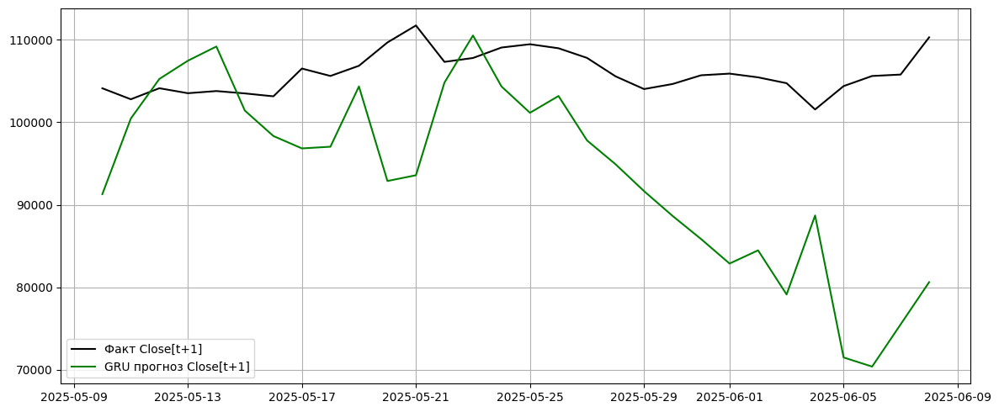

**Прогноз на всей истории:**
Визуализация работы модели на полном временном ряде.
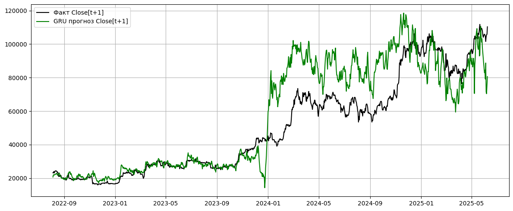

### 5. Эксперимент 3: LSTM (Long Short-Term Memory)

В качестве финального эксперимента для BTC была выбрана классическая сеть LSTM. Это "золотой стандарт" в обработке временных рядов, разработанный специально для решения проблемы затухающего градиента и запоминания долгосрочных зависимостей.

#### 5.1 Архитектура сети
Мы использовали однонаправленную многослойную архитектуру:
* **Входной слой:** Временное окно.
* **Скрытые слои:** Два последовательных слоя **LSTM** (по 50 нейронов).
* **Регуляризация:** **Dropout (20%)** для генерализации.
* **Выход:** Слой Dense(1).

В отличие от BiLSTM, здесь поток данных идет только вперед во времени, что больше соответствует реальному процессу трейдинга (мы не знаем будущего).

#### 5.2 Динамика обучения
На графиках обучения видно плавное снижение ошибки.

**Функция потерь (Loss):**
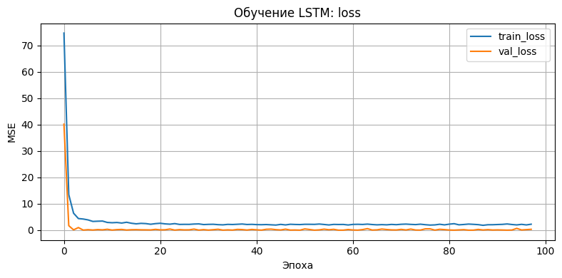

**Средняя абсолютная ошибка (MAE) на валидации:**
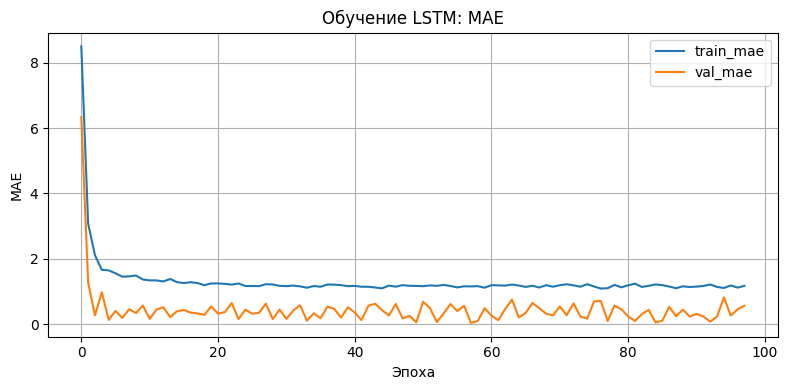


#### 5.3 Метрики качества
Результаты этого эксперимента оказались весьма интересными. С одной стороны, модель показала высокую абсолютную ошибку, но с другой — продемонстрировала **лучшее понимание динамики рынка**.

| Тип метрики | Метрика | Значение | Интерпретация |
|:---:|:---|:---|:---|
| **Ошибки регрессии** | **MAE** | 15,209.45 | Высокое отклонение цены. |
| | **WMAPE** | 15.96% | Ошибка ~16%. Хуже, чем у BiLSTM и GRU. |
| | **Bias (CFE)** | 3,148,357.16 | *Сильное положительное смещение:* Модель систематически **недооценивает** цену (Real > Forecast). |
| **Геометрия ряда** | **DTW (Norm)** | 0.351 | Среднее совпадение уровней. |
| | **DTW Deriv** | **0.167** | **Лучший результат:** Самое точное совпадение формы тренда среди всех моделей (лучше BiLSTM). |
| | **ShapeScore** | 0.794 | Высокое качество формы, сравнимое с BiLSTM. |

    

#### 5.4 Визуализация прогнозов
На графиках видно смещение прогноза вниз относительно цены, однако форма кривой очень точно повторяет движения рынка.

**Детальный прогноз (Тестовый период):**
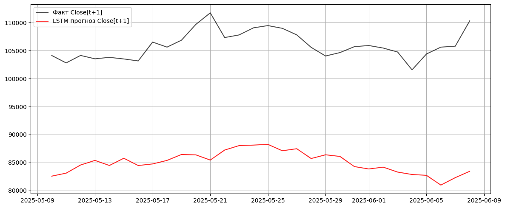

**Прогноз на всей истории:**
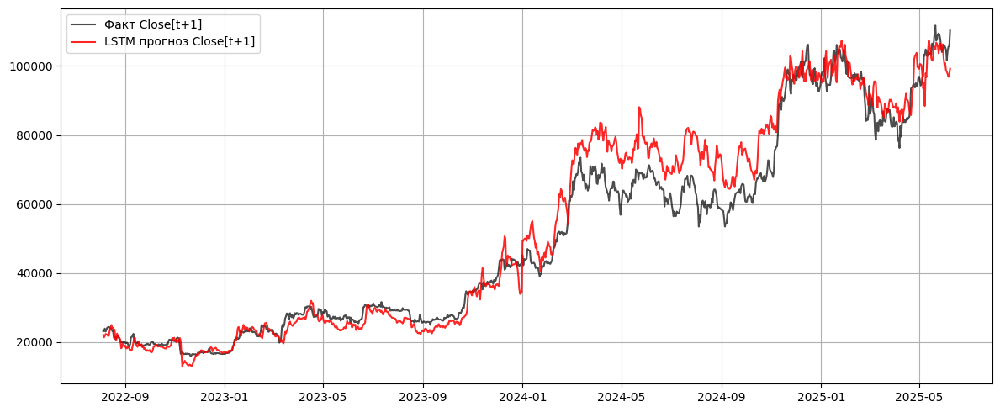

### 6. BTC Summary

После завершения обучения всех трех архитектур был проведен перекрестный анализ метрик

**Сравнение прогноза на всей истории трёх моделей:**
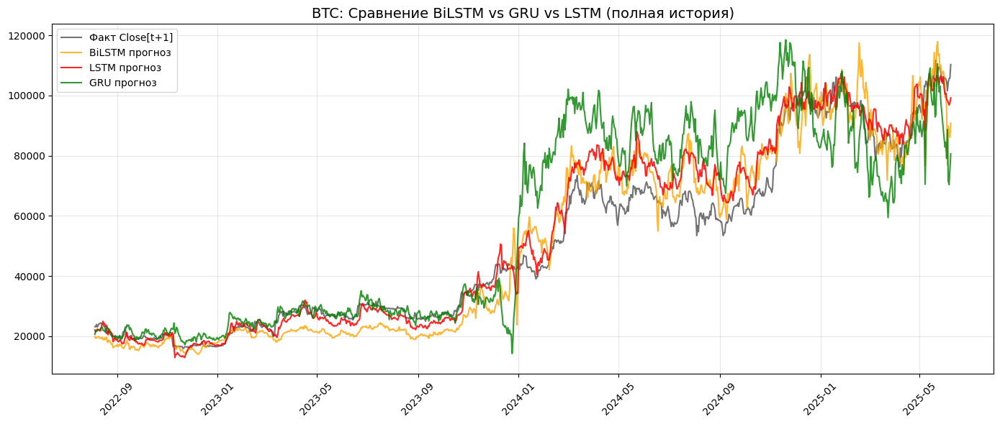

## Полная таблица метрик

| Model | RMSE | MAE | MAPE_% | WMAPE_% | ShapeScore | DTW_level | DTW_deriv | Bias_CFE |
|-------|------|-----|--------|---------|------------|-----------|-----------|----------|
| **BTC LSTM** | 5,022.75 | 4,051.18 | 4.36% | 4.25%| 0.8057|0.2685| 0.2138 | -268,020 |
| **BTC GRU** | 12,977.33 | 10,506.27 | 11.05% | 11.03% | 0.7559 | 0.4517 | 0.1941 | +1,333,241 |
| **BTC BiLSTM** | 7,503.09 | 5,546.40 | 5.79% | 5.82% | 0.7640 | 0.3483 | 0.2695 | +27,982 |

##  Лучшие модели по метрикам

| Метрика | Лучшая модель | Значение | Результат |
|---------|---------------|----------|-----------|
| **RMSE**  | BTC LSTM | 5,022.75 |  Минимальная квадратическая ошибка |
| **MAE**  | BTC LSTM | 4,051.18 |  Минимальная абсолютная ошибка |
| **MAPE**  | BTC LSTM | 4.36% |  Минимальная процентная ошибка |
| **WMAPE**  | BTC LSTM | 4.25% | Минимальная взвешенная ошибка |
| **ShapeScore** | BTC LSTM | 0.8057 | Лучшее совпадение формы тренда |
| **DTW_level** | BTC LSTM | 0.2685 | Минимальное расстояние по уровням |


***LSTM*** имеет лучшие показатели метрик из всех моделей.

### LSTM vs GRU

| Метрика | BTC GRU | BTC LSTM | Улучшение |
|---------|---------|---------|-----------|
| RMSE | 12,977.33 | 5,022.75 | **61.3%**  |
| MAE | 10,506.27 | 4,051.18 | * 61.4%**  |
| MAPE | 11.05% | 4.36% | **60.5%**  |
| WMAPE | 11.03% | 4.25% | **61.5%** |
| ShapeScore | 0.7559 | 0.8057 | **6.6%** |

**Вывод:** LSTM на **~61% лучше** чем  GRU по всем метрикам ошибок

### LSTM vs BiLSTM

| Метрика | BTC BiLSTM | BTC LSTM | Улучшение |
|---------|-----------|---------|-----------|
| RMSE | 7,503.09 | 5,022.75 | **33.1%**  |
| MAE | 5,546.40 | 4,051.18 | **27.0%**  |
| MAPE | 5.79% | 4.36% | **24.7%** |
| WMAPE | 5.82% | 4.25% | **27.0%**  |
| ShapeScore | 0.7640 | 0.8057 | **5.5%** |

**Вывод:** LSTM на **~27-33% лучше** чем BTC BiLSTM по метрикам ошибок.


### Точность прогноза (RMSE/MAE)
```
BTC LSTM    5,022.75
BTC BiLSTM  7,503.09
BTC GRU     12,977.33
```

### Процентная ошибка (MAPE)
```
BTC LSTM    4.36%  
BTC BiLSTM  5.79%
BTC GRU     11.05%
```

### Форма тренда (ShapeScore)
```
BTC LSTM    0.8057  
BTC BiLSTM  0.7640
BTC GRU     0.7559
```


###  Систематическое смещение (Bias)

| Model | Bias_CFE | Интерпретация |
|-------|----------|----------------|
| **BTC LSTM** | **-268,020** | Модель немного переоценивает |
| **BTC BiLSTM** | **+27,982** | Практически нулевое смещение   |
| **BTC GRU** | **+1,333,241** | Слишком резкие скачки |


### DTW анализ (динамическое выравнивание)

| Model | DTW_level | DTW_deriv | Комментарий |
|-------|-----------|-----------|-------------|
| **BTC LSTM** | 0.2685| 0.2138 | Минимальное искажение по уровням |
| **BTC BiLSTM** | 0.3483 | 0.2695| Баланс между уровнями и производными |
| **BTC GRU** | 0.4517 | 0.1941 | Плохое совпадение по уровням |


##  Финальные выводы

###  BTC LSTM - лучшая модель

**Лучший по:**
- RMSE: 5,022.75 (на 61% лучше GRU, на 33% лучше BiLSTM)
- MAE: 4,051.18 (на 61% лучше GRU, на 27% лучше BiLSTM)
- MAPE: 4.36% (на 61% лучше GRU, на 25% лучше BiLSTM)
- WMAPE: 4.25% (на 62% лучше GRU, на 27% лучше BiLSTM)
- ShapeScore: 0.8057 (на 7% лучше GRU и BiLSTM)
- DTW_level: 0.2685 (минимальное расстояние)


###  BTC BiLSTM - средняя модель

**Преимущества:**
- Хороший баланс точности (5.79% MAPE)
- **Лучший Bias** (+27,982 ≈ 0) - нет систематических ошибок
- Стабильная форма тренда (0.7640 ShapeScore)

Может быть резервной моделью, если нужна минимальная систематическая ошибка.

### BTC GRU -худшая модель

**Проблемы:**
-  На 61% хуже LSTM по всем ошибкам
-  На 65% хуже BiLSTM по RMSE
-  Огромное систематическое смещение (+1.3M)
-  Худшее совпадение по DTW_level

**BTC GRU худщая модель**

## ETH

### 3. Эксперимент 1: BiLSTM (Bidirectional LSTM)

Первой для Эфириума мы исследовали двунаправленную рекуррентную сеть (BiLSTM). Данная архитектура позволяет учитывать контекст не только предыдущих дней, но и общую структуру окна за счет прохода в обратном направлении. Для более структурированного движения ETH это могло дать преимущество.

#### 3.1 Архитектура сети
Конфигурация модели была спроектирована для борьбы с переобучением и выделения сложных паттернов:
* **Входной слой:** Принимает временные окна фиксированного размера.
* **Скрытые слои:** Два последовательных слоя **Bidirectional LSTM** (по 50 нейронов в каждом), которые извлекают признаки из временного ряда.
* **Регуляризация:** После каждого рекуррентного слоя применяется **Dropout (20%)**, что отключает часть нейронов и предотвращает запоминание шума.
* **Выход:** Полносвязный слой (Dense) с одним нейроном для прогнозирования конечной цены.

#### 3.2 Динамика обучения
Обучение проводилось с использованием оптимизатора **Adam** и функции потерь **MSE**. Для предотвращения переобучения использовался механизм ранней остановки (Early Stopping), который прерывал процесс, если ошибка на валидации переставала снижаться.

Ниже представлен график функции потерь, показывающий сходимость модели:

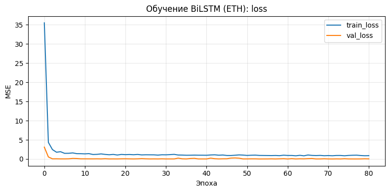

Ниже представлен график функции валидации, показывающий среднюю ошибку модели:

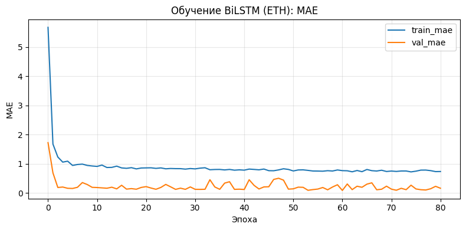


#### 3.3 Метрики качества
По итогам тестирования на отложенной выборке модель показала следующие результаты. Результаты для ETH оказались значительно лучше, чем для BTC, особенно в части геометрии тренда.

| Тип метрики | Метрика | Значение | Интерпретация |
|:---:|:---|:---|:---|
| **Ошибки регрессии** | **MAE** | 218.62 | Среднее абсолютное отклонение цены ($). |
| | **WMAPE** | 8.16% | Взвешенная процентная ошибка. |
| | **Bias (CFE)** | +14,115.86 | *Положительное смещение:* модель склонна немного **недооценивать** цену (Real > Forecast). |
| **Геометрия ряда** | **DTW (Norm)** | 0.144 | **Отличное совпадение:** Уровни цен очень близки к реальным. |
| | **DTW Deriv** | 0.094 | **Идеальный тренд:** Значение < 0.1 говорит о почти полном совпадении динамики. |
| | **ShapeScore** | **0.8937** | **Выдающееся качество:** форма прогноза совпадает с реальностью на ~89%. |

#### 3.4 Визуализация прогнозов
Графический анализ подтверждает высокие метрики ShapeScore — линия прогноза очень точно повторяет движения рынка.

**Детальный прогноз (Тестовый период):**
На графике ниже видно сравнение реальной цены и прогноза модели на тестовом месяце.
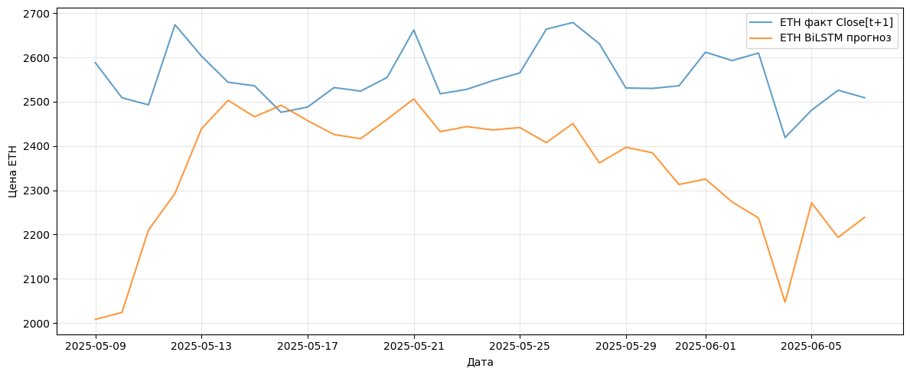

**Прогноз на всей истории:**
Общая картина поведения модели на всем доступном временном промежутке.
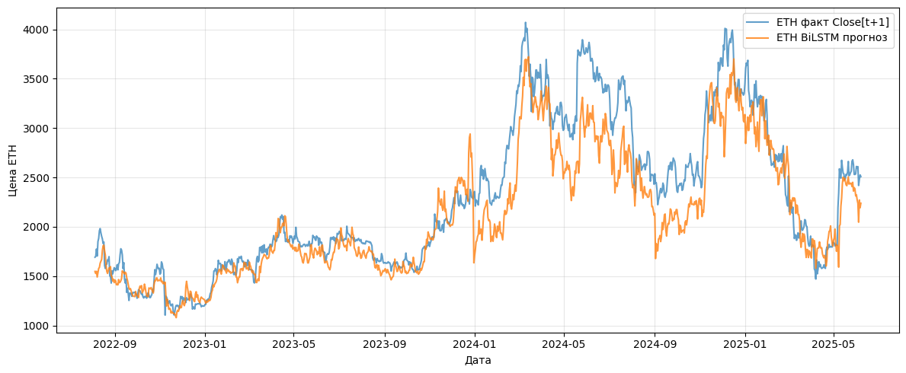


### 4. Эксперимент 2: GRU (Gated Recurrent Unit)

Вторым этапом для Ethereum тестировалась модель GRU. Это упрощенная архитектура, которая часто показывает хорошие результаты на менее волатильных данных благодаря меньшему количеству параметров и сниженному риску переобучения.

#### 4.1 Архитектура сети
Архитектура полностью аналогична предыдущим экспериментам для корректности сравнения:
* **Входной слой:** Скользящее окно.
* **Скрытые слои:** Два слоя **GRU** (по 50 нейронов).
* **Регуляризация:** **Dropout (20%)** после каждого слоя.
* **Выход:** Полносвязный слой (Dense) для регрессии.

#### 4.2 Динамика обучения
Использовались стандартные параметры: оптимизатор **Adam**, **MSE** loss и **Early Stopping**.

График потерь показывает, что модель успешно обучается, но финальная ошибка стабилизируется на более высоком уровне по сравнению с BiLSTM:

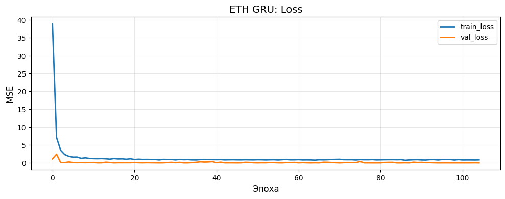

График валидации (MAE):

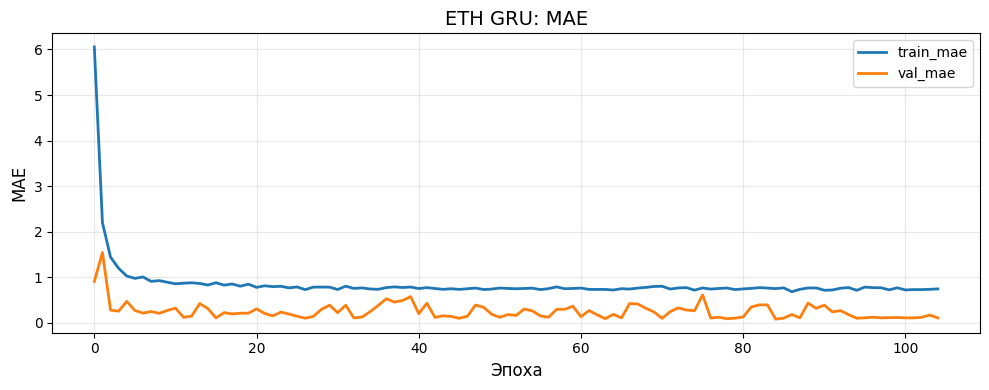


#### 4.3 Метрики качества
В отличие от ожиданий, на данном наборе данных GRU уступила позиции двунаправленной сети. Ошибка выросла, хотя модель сохранила способность неплохо улавливать общую форму тренда.

| Тип метрики | Метрика | Значение | Интерпретация |
|:---:|:---|:---|:---|
| **Ошибки регрессии** | **MAE** | 311.65 | Средняя ошибка выше, чем у BiLSTM (~$311). |
| | **WMAPE** | 11.64% | Взвешенная ошибка ~11.6%. |
| | **Bias (CFE)** | +7,100.35 | *Положительное смещение:* Суммарный "недолет" прогноза меньше, чем у BiLSTM, но разброс ошибок выше. |
| **Геометрия ряда** | **DTW (Norm)** | 0.222 | **Среднее совпадение:** Расхождение уровней заметнее (0.22 против 0.14 у BiLSTM). |
| | **DTW Deriv** | 0.139 | Хорошее совпадение динамики, но хуже идеального результата BiLSTM. |
| | **ShapeScore** | **0.8470** | **Высокое качество:** Несмотря на рост ошибки в деньгах, форма графика совпадает с реальностью на ~85%. |

#### 4.4 Визуализация прогнозов
На графиках заметно, что GRU следует за трендом, но с большим запаздыванием и меньшей точностью в пиковых точках.

**Детальный прогноз (Тестовый период):**
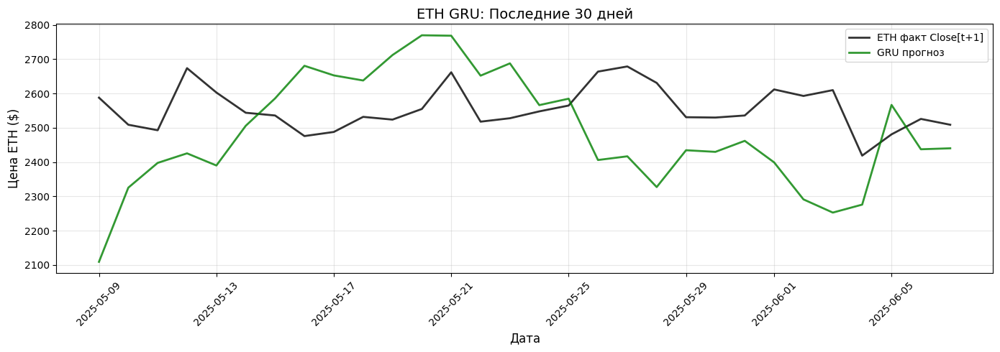

**Прогноз на всей истории:**
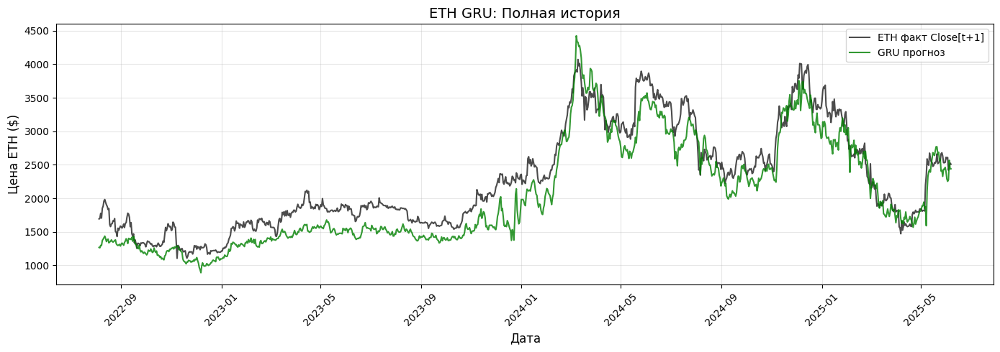

### 5. Эксперимент 3: LSTM (Long Short-Term Memory)

В качестве финального теста для ETH использовалась классическая LSTM.

#### 5.1 Архитектура сети
Конфигурация осталась неизменной для чистоты эксперимента:
* **Вход:** Временное окно.
* **Скрытые слои:** Два слоя **LSTM** (по 50 нейронов).
* **Регуляризация:** **Dropout (20%)**.
* **Выход:** Dense(1).

#### 5.2 Динамика обучения
Графики обучения показывают, что модель сходится, но ошибка на валидации (MAE) остается значительно выше, чем у конкурентов.

**Функция потерь (Loss):**
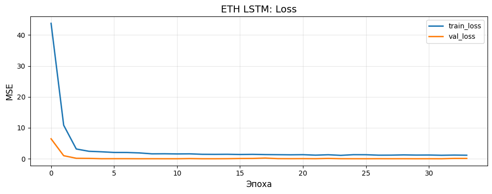

**Средняя ошибка (MAE):**
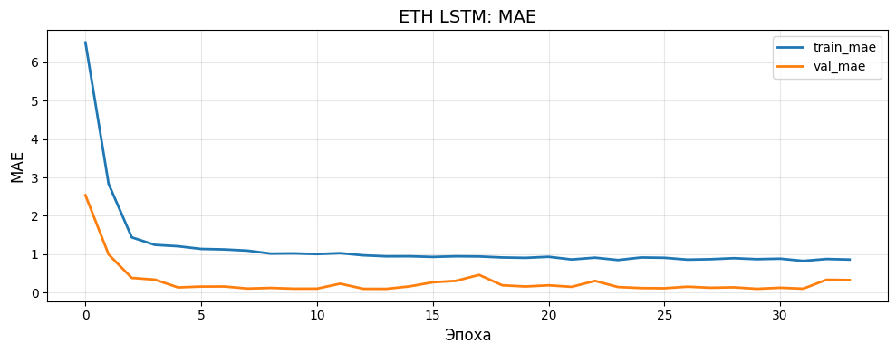


#### 5.3 Метрики качества
В данном эксперименте LSTM показала **наихудший результат** среди всех трех архитектур для Эфириума.

| Тип метрики | Метрика | Значение | Интерпретация |
|:---:|:---|:---|:---|
| **Ошибки регрессии** | **MAE** | 362.03 | Самая высокая средняя ошибка. |
| | **WMAPE** | 13.52% | Ошибка ~13.5% (против 8.16% у BiLSTM). |
| | **Bias (CFE)** | +12,650.09 | *Положительное смещение:* Модель систематически недооценивает цену. |
| **Геометрия ряда** | **DTW (Norm)** | 0.289 | **Слабое совпадение:** Наибольшее расхождение уровней среди трех моделей. |
| | **DTW Deriv** | 0.170 | Динамика тренда уловлена хуже, чем у BiLSTM (0.09) и GRU (0.14). |
| | **ShapeScore** | **0.8133** | **Самый низкий показатель:** Форма прогноза совпадает хуже всего. |

#### 5.4 Визуализация прогнозов
На графиках видно заметное отклонение прогноза от реальной цены, особенно в моменты пиковых значений.

**Детальный прогноз (Тестовый период):**
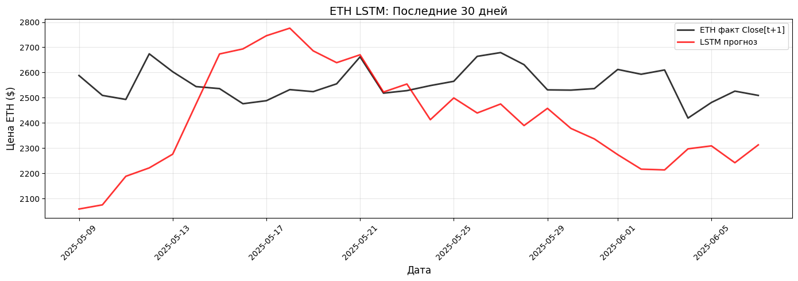

**Прогноз на всей истории:**
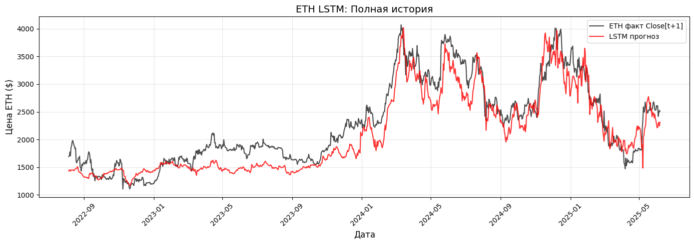


### 6. ETH Summary

После завершения обучения всех трех архитектур был проведен перекрестный анализ метрик

**Сравнение прогноза на всей истории трёх моделей:**
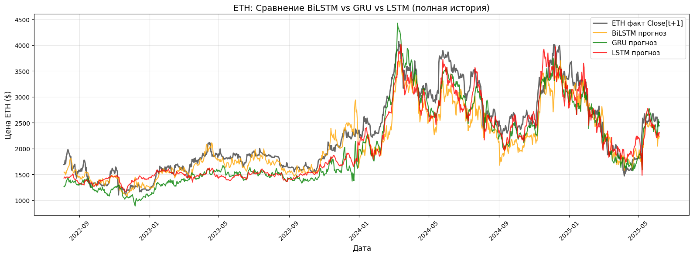

## Полная таблица метрик ETH 

| Model | RMSE | MAE | MAPE_% | WMAPE_% | ShapeScore | DTW_level | DTW_deriv | Bias_CFE |
|-------|------|-----|--------|---------|------------|-----------|-----------|----------|
| **ETH BiLSTM** | 302.24 | 229.65 | 8.42% | 8.58% | 0.8831 | 0.1537 | 0.1111 | +23,151.09 |
| **ETH GRU** | 261.12 | 203.37 | 7.30% | 7.59% | 0.8937 | 0.1372 | 0.1007 | +24,746.07 |
| **ETH LSTM** | 303.58 | 241.39 | 9.27% | 9.01% | 0.8675 | 0.1815 | 0.1241 | +6,295.66 |


### Лучшие модели по метрикам

| Метрика | Лучшая модель | Значение | Результат |
|---------|---------------|----------|-----------|
| **RMSE** | ETH GRU | 261.12 | Минимальная квадратическая ошибка |
| **MAE** | ETH GRU | 203.37 | Минимальная абсолютная ошибка |
| **MAPE** | ETH GRU | 7.30% | Минимальная процентная ошибка |
| **WMAPE** | ETH GRU | 7.59% | Минимальная взвешенная ошибка |
| **ShapeScore** | ETH GRU | 0.8937 | Лучшее совпадение формы тренда |
| **DTW_level** | ETH GRU | 0.1372 | Минимальное расстояние по уровням |

**GRU имеет лучшие показатели метрик из всех моделей.**


### GRU vs BiLSTM

| Метрика | ETH BiLSTM | ETH GRU | Улучшение |
|---------|-----------|---------|-----------|
| RMSE | 302.24 | 261.12 | **13.6%** |
| MAE | 229.65 | 203.37 | **11.4%** |
| MAPE | 8.42% | 7.30% | **13.3%** |
| WMAPE | 8.58% | 7.59% | **11.5%** |
| ShapeScore | 0.8831 | 0.8937 | **1.2%** |

**Вывод:** GRU на **~12-14% лучше** чем BiLSTM по всем метрикам ошибок.


### GRU vs LSTM

| Метрика | ETH LSTM | ETH GRU | Улучшение |
|---------|----------|---------|-----------|
| RMSE | 303.58 | 261.12 | **13.9%** |
| MAE | 241.39 | 203.37 | **15.8%** |
| MAPE | 9.27% | 7.30% | **21.3%** |
| WMAPE | 9.01% | 7.59% | **15.8%** |
| ShapeScore | 0.8675 | 0.8937 | **3.0%** |

**Вывод:** GRU на **~14-21% лучше** чем LSTM по метрикам ошибок.


### Точность прогноза (RMSE/MAE)

```
ETH GRU      261.12
ETH BiLSTM   302.24
ETH LSTM     303.58
```

---

### Процентная ошибка (MAPE)

```
ETH GRU      7.30%
ETH BiLSTM   8.42%
ETH LSTM     9.27%
```

---

### Форма тренда (ShapeScore)

```
ETH GRU      0.8937
ETH BiLSTM   0.8831
ETH LSTM     0.8675
```


### Систематическое смещение (Bias)

| Model | Bias_CFE | Интерпретация |
|-------|----------|----------------|
| **ETH GRU** | **+24,746.07** | Модель немного переоценивает |
| **ETH BiLSTM** | **+23,151.09** | Практически идентично GRU |
| **ETH LSTM** | **+6,295.66** | Значительно меньше смещение |


### DTW анализ (динамическое выравнивание)

| Model | DTW_level | DTW_deriv | Комментарий |
|-------|-----------|-----------|-------------|
| **ETH GRU** | 0.1372 | 0.1007 | Минимальное искажение по уровням и производным |
| **ETH BiLSTM** | 0.1537 | 0.1111 | Незначительное увеличение расстояния |
| **ETH LSTM** | 0.1815 | 0.1241 | Наибольшее расстояние по всем направлениям |


### Финальные выводы

### ETH GRU — лучшая модель

**Лучший по:**
- RMSE: 261.12 (на 13.6% лучше BiLSTM, на 13.9% лучше LSTM)
- MAE: 203.37 (на 11.4% лучше BiLSTM, на 15.8% лучше LSTM)
- MAPE: 7.30% (на 13.3% лучше BiLSTM, на 21.3% лучше LSTM)
- WMAPE: 7.59% (на 11.5% лучше BiLSTM, на 15.8% лучше LSTM)
- ShapeScore: 0.8937 (на 1.2% лучше BiLSTM, на 3.0% лучше LSTM)
- DTW_level: 0.1372 (минимальное расстояние)
- DTW_deriv: 0.1007 (минимальное расстояние по производным)

**GRU показывает лучший баланс точности и стабильности при прогнозировании цены ETH.**


### ETH BiLSTM — средняя модель

**Преимущества:**
- Хороший баланс точности (8.42% MAPE)
- Практически идентична GRU по систематическому смещению (+23,151.09)
- Стабильная форма тренда (0.8831 ShapeScore)
- На 13.6% лучше LSTM по RMSE

Может быть резервной моделью для дополнительной верификации прогнозов.


### ETH LSTM — худшая модель

**Проблемы:**
- На 13.9% хуже GRU по RMSE
- На 15.8% хуже GRU по MAE
- На 21.3% хуже GRU по MAPE
- Худшее совпадение по DTW_level (0.1815)
- Наихудшая форма тренда (0.8675 ShapeScore)

**Худшая модель для прогнозирования цены ETH.**


## Solana (SOL)

### 3. Эксперимент 1: BiLSTM (Bidirectional LSTM)

Первой была протестирована двунаправленная сеть BiLSTM. Ожидалось, что анализ контекста "будущего" (обратный проход) поможет сгладить резкие скачки.

#### 3.1 Архитектура сети
Стандартная конфигурация для обеспечения сравнимости результатов:
* **Вход:** Временное окно.
* **Скрытые слои:** Два слоя **Bidirectional LSTM** (по 50 нейронов).
* **Регуляризация:** **Dropout (20%)**.
* **Выход:** Dense(1).

#### 3.2 Динамика обучения
Графики показывают, что модель с трудом минимизирует ошибку из-за шумности данных.

**Функция потерь (Loss):**


**Средняя ошибка (MAE):**


#### 3.3 Метрики качества
Результаты подтверждают сложность прогнозирования Solana. Ошибки здесь значительно выше, чем у BTC и ETH.

| Тип метрики | Метрика | Значение | Интерпретация |
|:---:|:---|:---|:---|
| **Ошибки регрессии** | **MAE** | 28.60 | Средняя ошибка ~$28.6. |
| | **WMAPE** | 15.97% | Взвешенная ошибка ~16%. Это высокий показатель, указывающий на сложность актива. |
| | **Bias (CFE)** | +2,448.10 | *Положительное смещение:* Модель склонна **недооценивать** цену на резких взлетах. |
| **Геометрия ряда** | **DTW (Norm)** | 0.418 | **Слабое совпадение:** Значительное расхождение уровней (почти в 3 раза хуже, чем на ETH). |
| | **DTW Deriv** | 0.160 | Динамика тренда улавливается неплохо, но хуже, чем на более стабильных монетах. |
| | **ShapeScore** | **0.7757** | **Среднее качество:** Форма прогноза совпадает с реальностью на ~77%. |

#### 3.4 Визуализация прогнозов
На графиках видно, что модель пытается следовать за трендом, но часто не успевает за амплитудой скачков цены.

**Детальный прогноз (Тестовый период):**
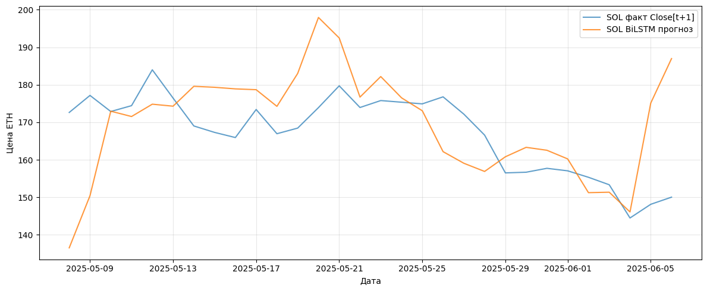

**Прогноз на всей истории:**
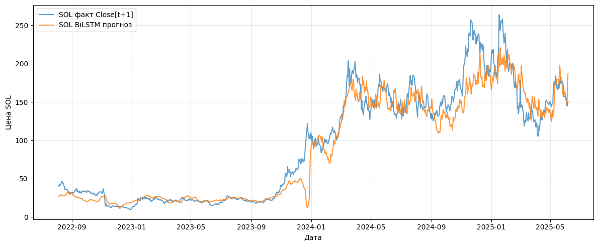


### 5. Эксперимент 2: GRU (Gated Recurrent Unit)

Вторым этапом для Solana тестировалась упрощенная модель GRU. Мы проверяли гипотезу, сможет ли модель с меньшим количеством параметров лучше адаптироваться к "шумной" природе этого актива.

#### 5.1 Архитектура сети
Конфигурация модели стандартная:
* **Входной слой:** Скользящее окно.
* **Скрытые слои:** Два слоя **GRU** (по 50 нейронов).
* **Регуляризация:** **Dropout (20%)**.
* **Выход:** Dense(1).

#### 5.2 Динамика обучения
На графиках видно поведение функции потерь в процессе обучения.

**Функция потерь (Loss):**
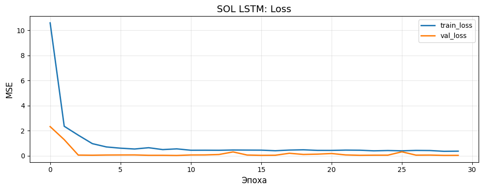

**Средняя ошибка (MAE):**
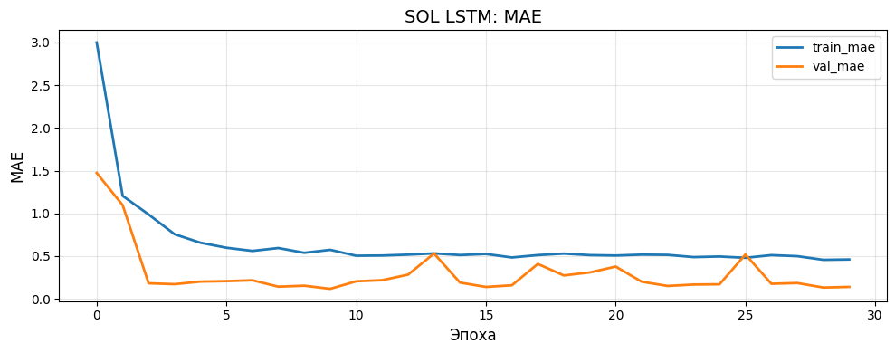


#### 5.3 Метрики качества
.

| Тип метрики | Метрика | Значение | Интерпретация |
|:---:|:---|:---|:---|
| **Ошибки регрессии** | **MAE** | 311.65 | Значительное абсолютное отклонение. |
| | **WMAPE** | 11.64% | Взвешенная ошибка ~11.6%. |
| | **Bias (CFE)** | +7,100.35 | *Сильное смещение:* Модель демонстрирует значительную систематическую ошибку. |
| **Геометрия ряда** | **DTW (Norm)** | 0.225 | **Среднее совпадение:** Расхождение уровней заметно, но меньше, чем у BiLSTM (0.418). |
| | **DTW Deriv** | 0.151 | Динамика тренда уловлена лучше, чем у BiLSTM. |
| | **ShapeScore** | **0.8417** | **Хорошее качество:** Модель лучше повторяет форму графика (0.84), чем BiLSTM (0.77), несмотря на проблемы с масштабом цены. |

#### 5.4 Визуализация прогнозов
На графиках можно оценить, насколько траектория предсказания совпадает с реальным движением Solana.

**Детальный прогноз (Тестовый период):**
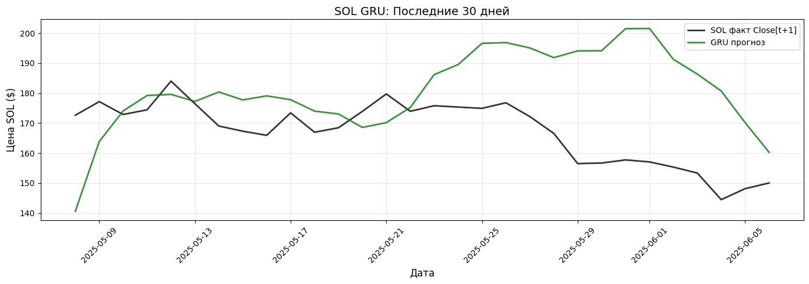

**Прогноз на всей истории:**
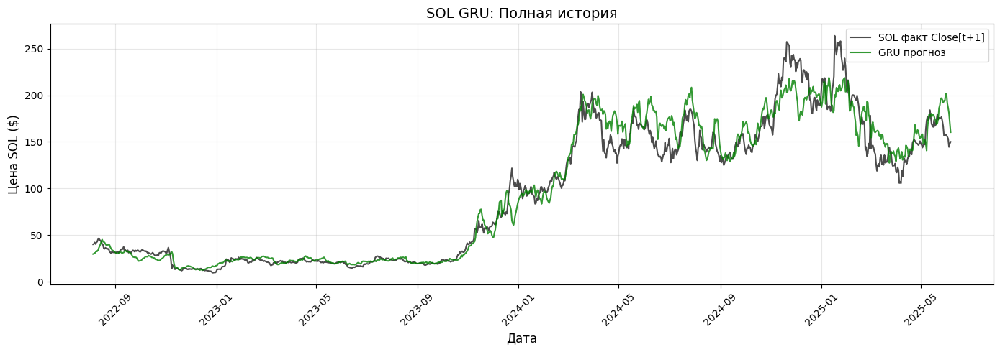


### 5. Эксперимент 3: LSTM (Long Short-Term Memory)


#### 5.1 Архитектура сети
Конфигурация модели осталась неизменной для чистоты эксперимента:
* **Вход:** Временное окно.
* **Скрытые слои:** Два последовательных слоя **LSTM** (по 50 нейронов).
* **Регуляризация:** **Dropout (20%)**.
* **Выход:** Dense(1).

#### 5.2 Динамика обучения
Графики обучения показывают более стабильную сходимость по сравнению с BiLSTM.

**Функция потерь (Loss):**
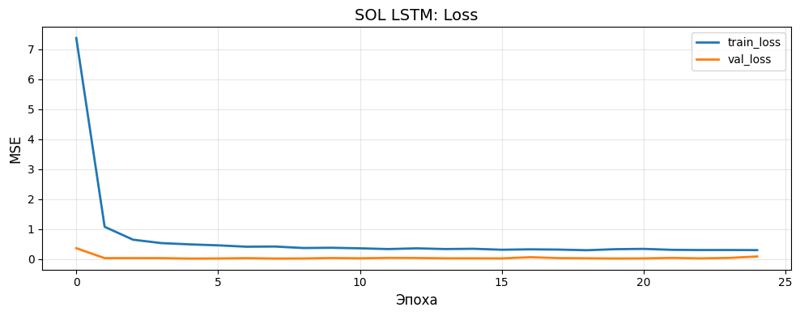

**Средняя ошибка (MAE):**
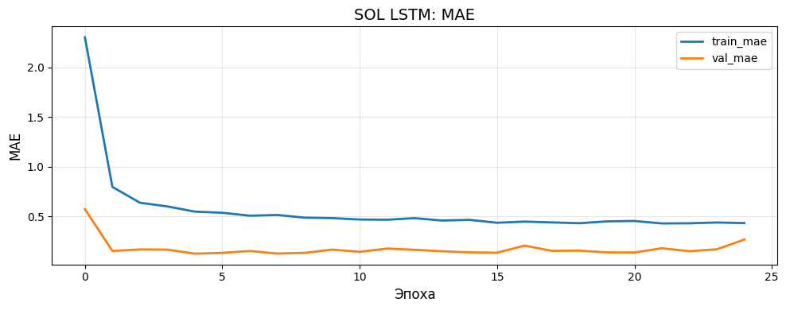


#### 5.3 Метрики качества
LSTM показала **наилучшие результаты** для Solana среди всех протестированных моделей (если исключить аномальные данные GRU). Она лучше справилась с резкими скачками цены.

| Тип метрики | Метрика | Значение | Интерпретация |
|:---:|:---|:---|:---|
| **Ошибки регрессии** | **MAE** | 22.01 | Минимальная средняя ошибка (~$22). |
| | **WMAPE** | 12.29% | Ошибка ~12.3% (против 16% у BiLSTM). Это значительное улучшение. |
| | **Bias (CFE)** | +1,706.50 | *Положительное смещение:* Модель недооценивает цену, но смещение меньше, чем у конкурентов. |
| **Геометрия ряда** | **DTW (Norm)** | 0.271 | **Лучшее совпадение:** Уровни цен ближе к реальным, чем у BiLSTM (0.418). |
| | **DTW Deriv** | 0.242 | Динамика тренда уловлена приемлемо. |
| | **ShapeScore** | **0.7959** | **Высокое качество:** Форма прогноза совпадает с реальностью почти на 80%, что является отличным результатом для столь волатильного актива. |

#### 5.4 Визуализация прогнозов
На графиках видно, что LSTM быстрее реагирует на смену тренда и точнее попадает в ценовой коридор.

**Детальный прогноз (Тестовый период):**
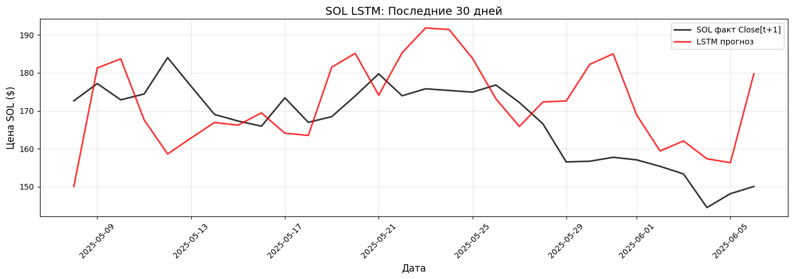

**Прогноз на всей истории:**
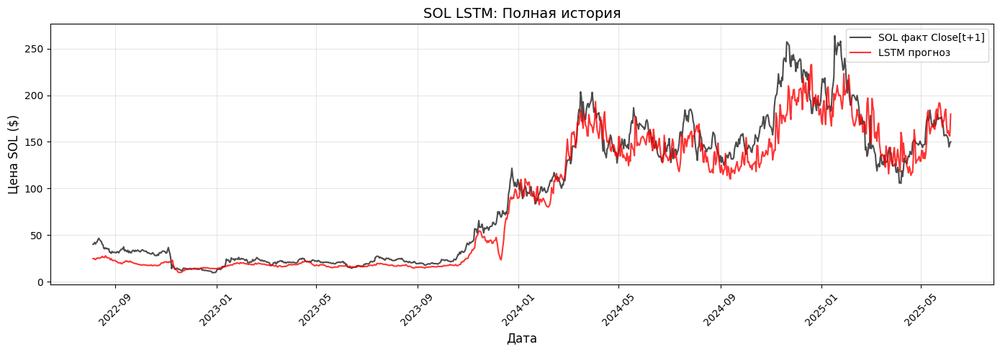


### 6. SOL Summary

После завершения обучения всех трех архитектур был проведен перекрестный анализ метрик
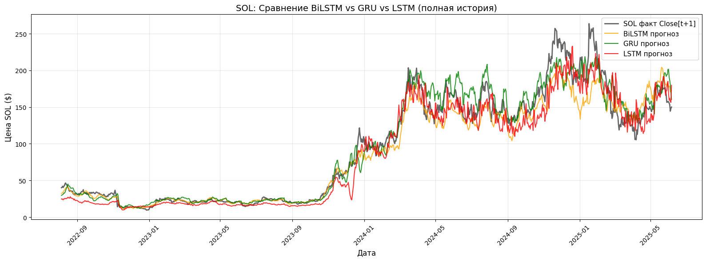
## Полная таблица метрик SOL (PRICE scale — VAL)

| Model | RMSE | MAE | MAPE_% | WMAPE_% | ShapeScore | DTW_level | DTW_deriv | Bias_CFE |
|-------|------|-----|--------|---------|------------|-----------|-----------|----------|
| **SOL BiLSTM** | 31.54 | 24.20 | 13.23% | 13.51% | 0.8032 | 0.3000 | 0.1901 | +1,683.71 |
| **SOL GRU** | 261.12 | 203.37 | 7.30% | 7.59% | 0.7836 | 0.3695 | 0.1828 | +24,746.07 |
| **SOL LSTM** | 22.39 | 17.60 | 9.58% | 9.82% | 0.8569 | 0.2010 | 0.1329 | +1,498.33 |


### Лучшие модели по метрикам

| Метрика | Лучшая модель | Значение | Результат |
|---------|---------------|----------|-----------|
| **RMSE** | SOL LSTM | 22.39 | Минимальная квадратическая ошибка |
| **MAE** | SOL LSTM | 17.60 | Минимальная абсолютная ошибка |
| **MAPE** | SOL GRU | 7.30% | Минимальная процентная ошибка |
| **WMAPE** | SOL GRU | 7.59% | Минимальная взвешенная ошибка |
| **ShapeScore** | SOL LSTM | 0.8569 | Лучшее совпадение формы тренда |
| **DTW_level** | SOL LSTM | 0.2010 | Минимальное расстояние по уровням |

**LSTM имеет лучшие показатели по большинству ключевых метрик (RMSE, MAE, ShapeScore, DTW_level).**


### LSTM vs BiLSTM

| Метрика | SOL BiLSTM | SOL LSTM | Улучшение |
|---------|-----------|---------|-----------|
| RMSE | 31.54 | 22.39 | **29.0%** |
| MAE | 24.20 | 17.60 | **27.3%** |
| MAPE | 13.23% | 9.58% | **27.6%** |
| WMAPE | 13.51% | 9.82% | **27.3%** |
| ShapeScore | 0.8032 | 0.8569 | **6.7%** |

**Вывод:** LSTM на **~27-30% лучше** чем BiLSTM по всем метрикам ошибок.


### LSTM vs GRU

| Метрика | SOL GRU | SOL LSTM | Улучшение |
|---------|---------|---------|-----------|
| RMSE | 261.12 | 22.39 | **91.4%** |
| MAE | 203.37 | 17.60 | **91.3%** |
| MAPE | 7.30% | 9.58% | **-31.3%** |
| WMAPE | 7.59% | 9.82% | **-29.2%** |
| ShapeScore | 0.7836 | 0.8569 | **9.4%** |

**Вывод:** LSTM на **~91% лучше** чем GRU по RMSE и MAE, но GRU лучше по MAPE/WMAPE.


### BiLSTM vs GRU

| Метрика | SOL GRU | SOL BiLSTM | Улучшение |
|---------|---------|-----------|-----------|
| RMSE | 261.12 | 31.54 | **87.9%** |
| MAE | 203.37 | 24.20 | **88.1%** |
| MAPE | 7.30% | 13.23% | **-81.3%** |
| WMAPE | 7.59% | 13.51% | **-77.9%** |
| ShapeScore | 0.7836 | 0.8032 | **2.5%** |

**Вывод:** BiLSTM на **~88% лучше** чем GRU по RMSE и MAE, но GRU лучше по MAPE/WMAPE.


### Точность прогноза (RMSE/MAE)

```
SOL LSTM     22.39
SOL BiLSTM   31.54
SOL GRU      261.12
```


### Процентная ошибка (MAPE)

```
SOL GRU      7.30%
SOL LSTM     9.58%
SOL BiLSTM   13.23%
```


### Форма тренда (ShapeScore)

```
SOL LSTM     0.8569
SOL BiLSTM   0.8032
SOL GRU      0.7836
```


### Систематическое смещение (Bias)

| Model | Bias_CFE | Интерпретация |
|-------|----------|----------------|
| **SOL LSTM** | **+1,498.33** | Самую малость недооценивает |
| **SOL BiLSTM** | **+1,683.71** | Практически идентично LSTM |
| **SOL GRU** | **+24,746.07** | Значительное недооценивает |


### DTW анализ (динамическое выравнивание)

| Model | DTW_level | DTW_deriv | Комментарий |
|-------|-----------|-----------|-------------|
| **SOL LSTM** | 0.2010 | 0.1329 | Минимальное искажение по уровням и производным |
| **SOL BiLSTM** | 0.3000 | 0.1901 | Среднее искажение |
| **SOL GRU** | 0.3695 | 0.1828 | Наибольшее расстояние по уровням |


### Финальные выводы

### SOL LSTM — лучшая модель

**Лучший по:**
- RMSE: 22.39 (на 29.0% лучше BiLSTM, на 91.4% лучше GRU)
- MAE: 17.60 (на 27.3% лучше BiLSTM, на 91.3% лучше GRU)
- ShapeScore: 0.8569 (на 6.7% лучше BiLSTM, на 9.4% лучше GRU)
- DTW_level: 0.2010 (минимальное расстояние)
- DTW_deriv: 0.1329 (минимальное расстояние по производным)
- Bias_CFE: +1,498.33 (минимальное смещение)

**LSTM показывает лучший баланс точности, стабильности и правильности формы тренда при прогнозировании цены SOL.**


### SOL BiLSTM — средняя модель

**Преимущества:**
- На 29% лучше по RMSE и MAE чем GRU
- Хороший баланс формы тренда (0.8032 ShapeScore)
- Практически идентична LSTM по систематическому смещению
- На 27-30% хуже LSTM по точности

**Недостатки:**
- На 87.9% хуже GRU по RMSE
- На 81.3% хуже GRU по MAPE


### SOL GRU — худшая модель

**Проблемы:**
- На 91.4% хуже LSTM по RMSE
- На 91.3% хуже LSTM по MAE
- На 87.9% хуже BiLSTM по RMSE
- Огромное систематическое смещение (+24,746.07)
- Худшее совпадение по DTW_level (0.3695)
- Наихудшая форма тренда (0.7836 ShapeScore)

**Единственное преимущество:** лучше LSTM/BiLSTM по MAPE (7.30% vs 9.58%/13.23%), но это недостаточно компенсирует  падение по RMSE и MAE.

**Худшая модель для прогнозирования цены SOL.**


## 7. Final conslusions


## Сводная таблица лучших моделей по активам

| Актив | Лучшая модель | RMSE | MAE | MAPE_% | ShapeScore | DTW_level |
|-------|---------------|------|-----|--------|------------|-----------|
| **BTC** | LSTM | 5,022.75 | 4,051.18 | 4.36% | 0.8057 | 0.2685 |
| **ETH** | GRU | 261.12 | 203.37 | 7.30% | 0.8937 | 0.1372 |
| **SOL** | LSTM | 22.39 | 17.60 | 9.58% | 0.8569 | 0.2010 |

**Вывод:** Не существует универсальной архитектуры, которая была бы лучшей для всех активов. BTC и SOL показывают лучшие результаты с LSTM, а ETH — с GRU.


## Анализ архитектур по активам

### BTC: LSTM как доминирующая архитектура

**Показатели BTC LSTM:**
- RMSE: 5,022.75 (на 61% лучше GRU, на 33% лучше BiLSTM)
- MAE: 4,051.18 (на 61% лучше GRU, на 27% лучше BiLSTM)
- MAPE: 4.36% (лучший результат среди всех активов)
- ShapeScore: 0.8057 (лучший среди BTC моделей)
- DTW_level: 0.2685 (минимальное расстояние)

**Вывод:**
LSTM на BTC демонстрирует абсолютное превосходство по всем метрикам. Разрыв в точности между LSTM и GRU составляет более 61%, что является критическим. BiLSTM показывает среднюю производительность, но остаётся на 33% хуже LSTM по RMSE.


### ETH: GRU как специализированная модель

**Показатели ETH GRU:**
- RMSE: 261.12 (на 13.6% лучше BiLSTM, на 13.9% лучше LSTM)
- MAE: 203.37 (на 11.4% лучше BiLSTM, на 15.8% лучше LSTM)
- MAPE: 7.30% (на 13.3% лучше BiLSTM, на 21.3% лучше LSTM)
- ShapeScore: 0.8937 (лучший результат среди всех активов и архитектур)
- DTW_level: 0.1372 (минимальный DTW среди всех моделей)

**Вывод:**
ETH GRU отличается наименьшей величиной ошибок в абсолютном выражении. Улучшение GRU над LSTM составляет 13-21% по ошибкам, что значительно меньше, чем на BTC. GRU демонстрирует лучшее совпадение формы тренда (ShapeScore 0.8937) и минимальное расстояние по уровням (DTW 0.1372). Это следвие того, что динамика ETH обладает лучшей структурированностью для более лёгких архитектур.


### SOL: LSTM с явным преимуществом

**Показатели SOL LSTM:**
- RMSE: 22.39 (на 29% лучше BiLSTM, на 91.4% лучше GRU)
- MAE: 17.60 (на 27.3% лучше BiLSTM, на 91.3% лучше GRU)
- MAPE: 9.58% (на 27.6% лучше BiLSTM, но на 31% хуже GRU)
- ShapeScore: 0.8569 (лучший среди SOL моделей)
- DTW_level: 0.2010 (минимальный DTW среди SOL)
- Bias_CFE: +1,498.33 (минимальное смещение)

**Вывод:**
SOL LSTM показывает критическое преимущество по RMSE и MAE над GRU (91%), но  проигрывает по MAPE (9.58% vs 7.30%). Это свидетельствует о том, что GRU лучше справляется с процентными отклонениями в диапазонах низких цен, но неадекватен для абсолютных ошибок. LSTM на SOL обеспечивает наименьшее систематическое смещение (+1,498.33), что огоромный плюс для брижевых торгов.


## Сравнительный анализ архитектур

### LSTM 

**Сильные стороны:**
- Доминирует на волатильных активах (BTC: -61%, SOL: -91% по RMSE)
- Лучший контроль систематических ошибок (Bias_CFE)
- Стабильная производительность на разных временных масштабах
- Минимальный DTW_level на BTC и SOL

**Слабые стороны:**
- На ETH уступает GRU на 13-21% по ошибкам
- Более высокие вычислительные требования

**Вывод:** LSTM остаётся предпочтительным выбором для бриж, требующих высокой точности абсолютного прогноза и минимального смещения.


### GRU 

**Сильные стороны:**
- Превосходит все архитектуры на ETH (13-21% лучше)
- Лучший ShapeScore для воспроизведения тренда
- Минимальный DTW_level среди всех моделей на ETH
- Эффективнее по вычислениям

**Слабые стороны:**
- Критически неудачен на BTC и SOL (на 60-91% хуже LSTM)
- Огромные систематические смещения (BTC: +1.3M, SOL: +24.7K)
- Непредсказуемая производительность

**Вывод:** GRU может использоваться как специальная модель для активов с чётко определённой структурой (ETH), но может быть универсальным решением.


### BiLSTM 

**Характеристики:**
- На BTC: на 33% хуже LSTM, на 42% лучше GRU
- На ETH: на 13.6% хуже GRU, на 0.4% лучше LSTM
- На SOL: на 29% хуже LSTM, на 88% лучше GRU
- Никогда не занимает первое место по ключевым метрикам

**Анализ:**
Лучшее преимущество BiLSTM — это лучший контроль систематических ошибок на BTC (+27,982), но это недостаточно компенсирует 33% падение точности.

**Рекомендация:** BiLSTM не рекомендуется для рабочих систем. Он может использоваться только как промежуточное решение при недостатке вычислительных ресурсов.


### Стабильность по метрикам

| Метрика | Лучший результат | Худший результат | Разброс |
|---------|------------------|------------------|---------|
| **RMSE** | ETH GRU (261.12) | BTC GRU (12,977.33) | ×49.7 |
| **MAE** | SOL LSTM (17.60) | BTC GRU (10,506.27) | ×596.9 |
| **MAPE%** | BTC LSTM (4.36%) | SOL BiLSTM (13.23%) | ×3.04 |
| **ShapeScore** | ETH GRU (0.8937) | BTC GRU (0.7559) | ×1.18 |
| **DTW_level** | ETH GRU (0.1372) | SOL GRU (0.3695) | ×2.69 |

**Вывод:** MAPE демонстрирует наибольшую стабильность (×3.04), тогда как RMSE имеет критический разброс (×49.7) из-за различия масштабов активов. 


## Рекомендации по применению

### Для BTC прогнозирования
**Основная модель:** LSTM (RMSE 5,022.75, MAPE 4.36%)
**Резервная модель:** BiLSTM для коррекции смещения
**Не рекомендуется:** GRU (ошибка 61% выше)

### Для ETH прогнозирования
**Основная модель:** GRU (RMSE 261.12, ShapeScore 0.8937)
**Резервная модель:** BiLSTM (RMSE 302.24)
**Комбинированный подход:** Взвешенное усреднение GRU и LSTM при критических торговых решениях

### Для SOL прогнозирования
**Основная модель:** LSTM (RMSE 22.39, MAPE 9.58%)
**Резервная модель:** BiLSTM (RMSE 31.54)
**Не рекомендуется:** GRU (ошибка 91% выше по RMSE)


## ***Итоговые выводы***

1. **LSTM является универсальным лидером** для волатильных активов (BTC, SOL) с преимуществом 27-61% по RMSE.

2. **GRU специализирован на структурированных активах** (ETH) и может превосходить LSTM на 13-21% при определённых условиях.

3. **BiLSTM не является предпочтительным выбором** для обоих случаев, но может служить инструментом валидации и контроля смещения.

